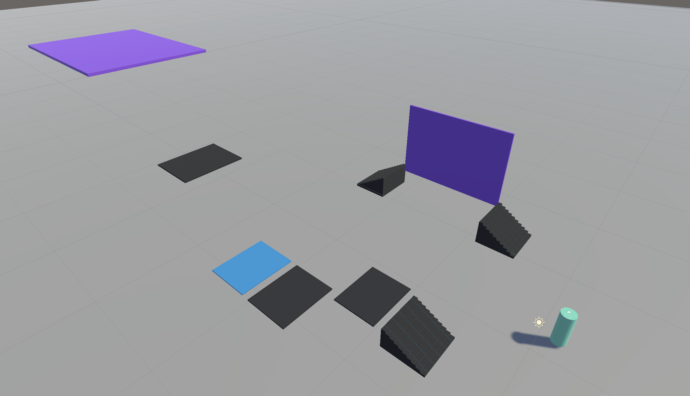
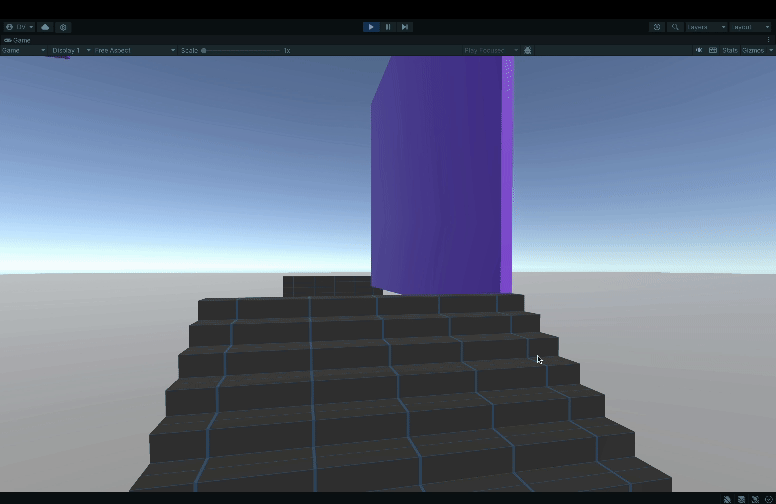
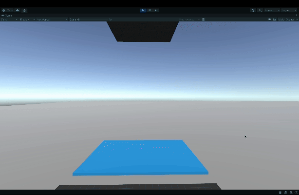
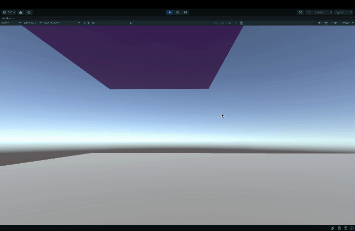

# 👩‍🚀  3D Gravity Mechanics Playground

This playground prototype was created to explore some gravity mechanics (inspired by Outer Wilds game).

## Features and Mechanics

This prototype introduces two distinct gravity mechanics:

* Gravity Walls: identifiable by their purple color, these walls exert a directional gravitational force on the player
  * Horizontal Gravity Wall: When interacting with this wall, the player experiences a 90-degree turn, as the force pulls them sideways.
  * Vertical Gravity Wall: This wall flips the player 180 degrees, creating an upside-down experience.

* Gravity Cannon: marked by a light blue color, this mechanic propels the player upwards in a specific direction. 
  * To successfully ascend to the higher platform, players must time their movement to exit the gravity field at the optimal moment.

## Visuals
* An overview of the playground.

* In the GIF below, the player navigates the first Gravity Wall. The gravitational force turns the player 90 degrees.

* The GIF demonstrates the Gravity Cannon. The player is propelled upwards to reach an elevated platform.

* This GIF showcases the second Gravity Wall's effect. The player experiences a complete 180-degree flip.

## Next Steps

Currently, this prototype lacks specific objectives or engaging goals for players. In future updates, I plan to enhance the gameplay experience by either:
- Developing puzzle levels that leverage existing gravity mechanics
- Designing an obstacle course using the gravity mechanics

